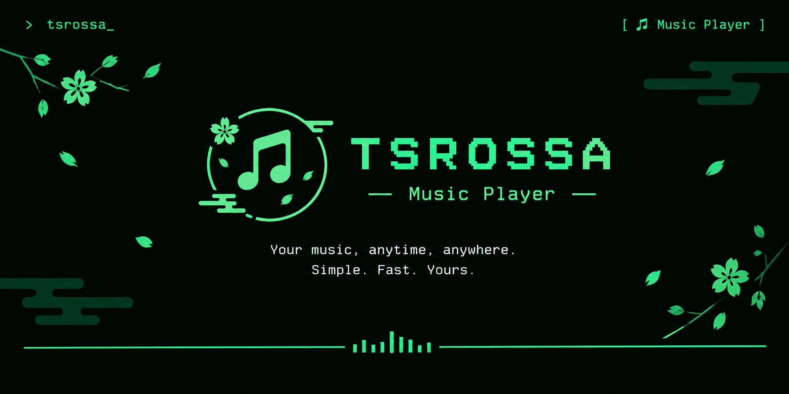
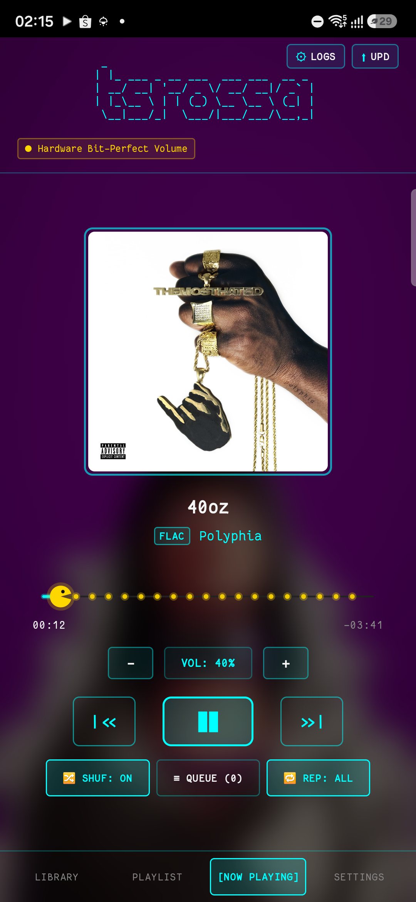
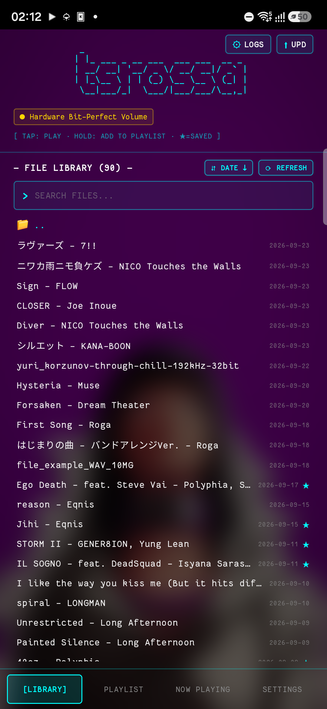
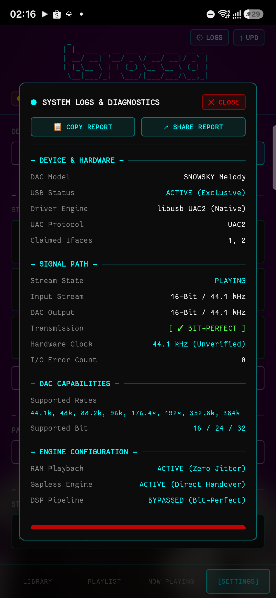

<p align="center">
  
</p>

<h1 align="center">tsrossa</h1>

<p align="center">
  <strong>Direct-to-DAC Bit-Perfect USB Audio Player for Android</strong><br/>
  High-fidelity C++17 audio engine bypassing Android AudioFlinger via kernel-level USB transport.
</p>

<p align="center">
  <a href="release/app-release.apk"></a>
  <a href="#"></a>
  <a href="#"></a>
  <a href="#"></a>
  <a href="#"></a>
  <a href="LICENSE"></a>
  <a href="https://bagibagi.co/Yukaatsu"></a>
</p>

---

## Overview

**tsrossa** is an open-source, bit-perfect music player developed specifically for audiophile USB DAC setups on Android. 

Standard Android audio architectures route playback through the system `AudioTrack` API and `AudioFlinger` mixing service. This pipeline enforces fixed 48 kHz sample-rate conversion (SRC), applies non-linear software digital volume attenuation, and introduces buffer jitter through multiple OS layers.

tsrossa eliminates the entire Android audio framework. By querying Android's USB Host API solely to acquire the raw device file descriptor (`usbfs`), the native C++17 engine interfaces directly with external DACs using `libusb-1.0`. PCM streams are transmitted directly across asynchronous USB Isochronous endpoints with exact hardware clock configuration, zero sample-rate conversion, zero DSP processing, and true unity gain.

---

## Interface

<table align="center">
  <tr>
    <td align="center" width="33%">
      
      <br/><b>Now Playing HUD</b><br/>
      <sub>Terminal interface with Pac-Man seek bar, dynamic album art palette, and hardware volume dial</sub>
    </td>
    <td align="center" width="33%">
      
      <br/><b>File Library</b><br/>
      <sub>Hierarchical file browser with Date/Name sorting, one-tap directory refresh, and timestamp indexing</sub>
    </td>
    <td align="center" width="33%">
      
      <br/><b>Hardware Telemetry</b><br/>
      <sub>Real-time UAC2 endpoint negotiation, hardware clock verification, RAM buffer state, and 1-tap report export</sub>
    </td>
  </tr>
</table>

---

## Architecture & Engineering

### 1. Direct Kernel USB Transport (`usbfs` + `libusb-1.0`)
- Circumvents `AudioTrack`, `AudioFlinger`, and vendor audio HAL layers entirely.
- Establishes a dedicated native C++ transfer loop utilizing Linux `usbfs` handles.
- Schedules asynchronous Isochronous transfers directly to the DAC's audio streaming endpoint.

### 2. Hardware Clock & Rate Negotiation (UAC1 / UAC2)
- Inspects USB Audio Class descriptors to map physical Clock Source and Clock Selector entities.
- Configures sample rates directly at the hardware crystal oscillator via `CS_SAMPLING_FREQ_CONTROL` requests.
- Eliminates Android's mandatory 48 kHz resampler: 44.1 kHz audio remains native 44.1 kHz, 96 kHz remains 96 kHz, up to 384 kHz.

### 3. In-Memory PCM Preload & Memory Locking (`mlock`)
- Decodes FLAC and WAV files into an uncompressed 32-bit linear PCM memory buffer prior to playback.
- Uses POSIX `mlock()` to lock audio pages in physical RAM, preventing Linux kernel swapping, flash memory I/O spikes, and micro-stutters.

### 4. Hardware Feature Unit Volume & True Unity Gain
- Implements logarithmic volume attenuation directly on the DAC hardware via USB Feature Unit volume requests (`FU_VOLUME_CONTROL`).
- Full volume (100% / 0.0 dB) engages true Bit-Perfect Unity Gain, preserving exact 0 dBFS dynamic range without digital math distortion.
- An optional software 64-bit dithered attenuation fallback is available for DACs lacking hardware volume units.

### 5. Gapless Streaming Handover
- Secondary background worker decodes the next queued track into RAM prior to current track completion.
- Seamlessly switches audio frames across endpoint boundaries without stream teardown, preventing pops, clicks, or timing gaps.

---

## Technical Specifications

| Parameter | Supported Range / Specification |
| :--- | :--- |
| **Supported Formats** | • **FLAC** (`.flac`): 16-bit, 24-bit, 32-bit integer PCM (44.1 kHz to 384 kHz)<br/>• **WAV** (`.wav`, `.wave`): 16-bit, 24-bit, 32-bit Linear PCM, and 32-bit IEEE Float |
| **Output Target** | External USB DACs via USB-C OTG (Dongles, Portable DAC/Amps, Desktop DACs) |
| **USB Audio Protocols** | USB Audio Class 1.0 (UAC1) and USB Audio Class 2.0 (UAC2) |
| **Endpoint Sync** | Asynchronous and Adaptive Isochronous endpoints |
| **Android Version** | Android 8.0 (API 26) through Android 15+ (API 35) |
| **Permissions Required** | `android.permission.READ_MEDIA_AUDIO` / `READ_EXTERNAL_STORAGE`, `USB_PERMISSION` |

> **Design Scope**: tsrossa is designed strictly as a high-fidelity bit-perfect transport for external USB DACs. Built-in phone speakers, internal 3.5mm jacks, and lossy formats (MP3, AAC, OGG) are intentionally excluded to keep the native audio pipeline clean and uncompromised.

---

## Test Audio Source

For testing bit-perfect playback with high-resolution FLAC files:
- **SpotiFLAC**: [spotiflac.com](https://spotiflac.com)
- **SpotiFLAC Mobile**: [GitHub Repository](https://github.com/spotiflacapp/SpotiFLAC-Mobile)

---

## Quick Start

### Installation
1. Download the latest release:
   - **Direct APK**: [`release/app-release.apk`](release/app-release.apk)
   - **GitHub Releases**: [tsrossa Releases](https://github.com/yukaatsu/tsrossa/releases)
2. Install the APK on your device.
3. Connect your USB DAC via OTG. Grant USB access permission when prompted.
4. Select a FLAC or WAV file in the Library browser to begin bit-perfect playback.

### Hardware Diagnostics
Tap **`[LOGS]`** in the header to view the real-time hardware status modal:
- Negotiated sample rate & bit depth
- Active interface endpoints and UAC protocol version
- Bit-perfect transmission verification
- Zero-jitter RAM playback and gapless engine status

Use **`[COPY REPORT]`** or **`[SHARE REPORT]`** to include hardware telemetry when opening an issue.

---

## Building from Source

### Prerequisites
- Android Studio Ladybug (or newer)
- Android NDK (r25c or higher)
- CMake 3.22.1+
- JDK 17+

### Build Instructions
```bash
# Clone the repository
git clone https://github.com/yukaatsu/tsrossa.git
cd tsrossa

# Build the release APK
./gradlew assembleRelease
```
The compiled APK will be located at:
`app/build/outputs/apk/release/app-release.apk`

---

## Support & Contributions

If you find tsrossa useful for your portable audiophile setup, consider supporting ongoing development:

[](https://bagibagi.co/Yukaatsu)

Contributions, issue reports, and DAC compatibility logs are welcome on [GitHub Issues](https://github.com/yukaatsu/tsrossa/issues).

---

## License

tsrossa is distributed under the [Apache License 2.0](LICENSE).
