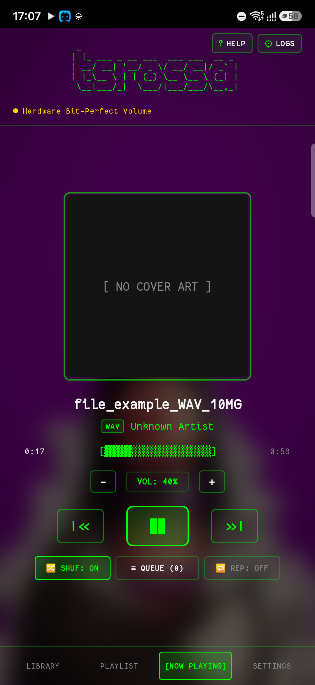
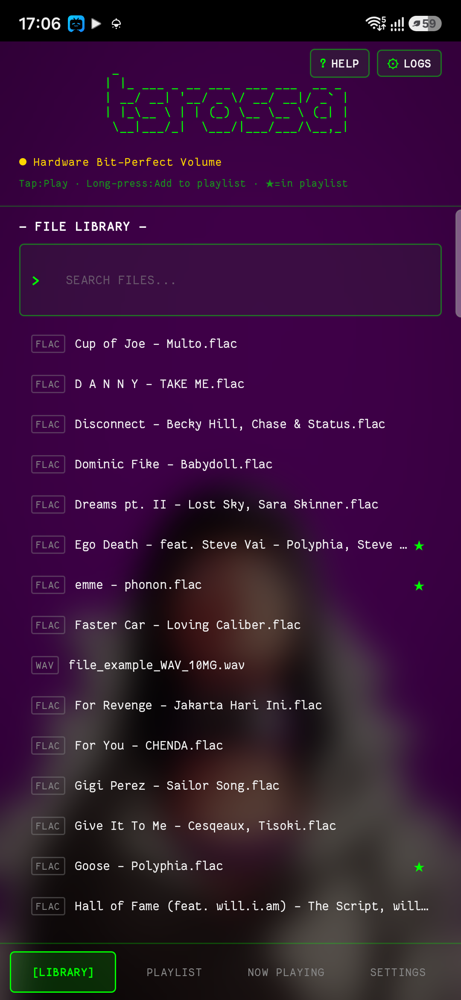
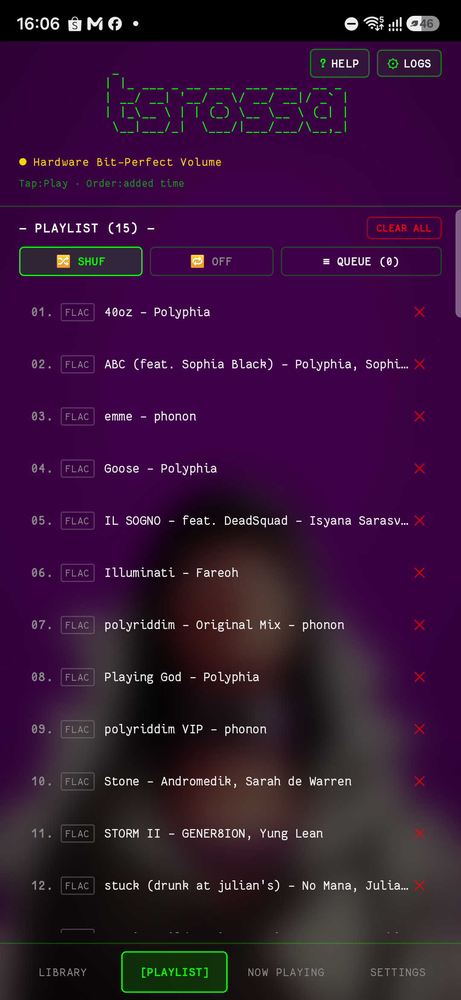
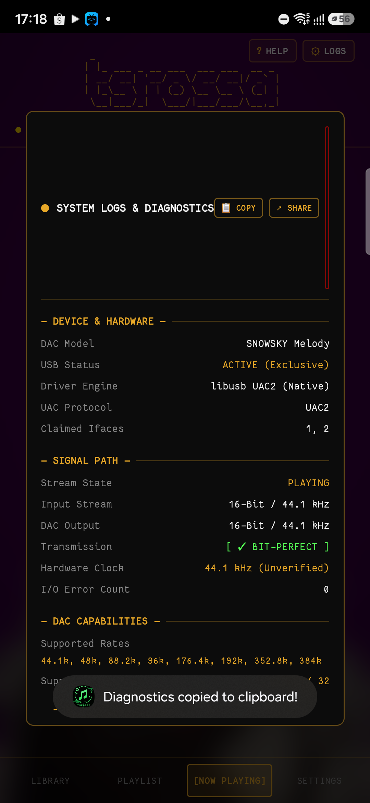
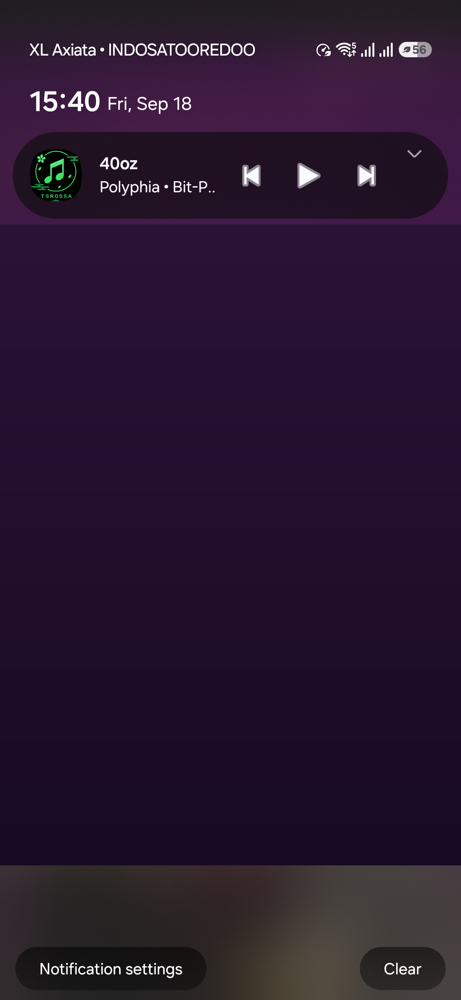
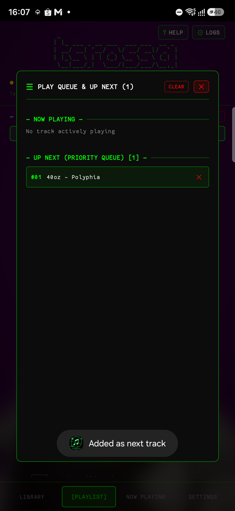
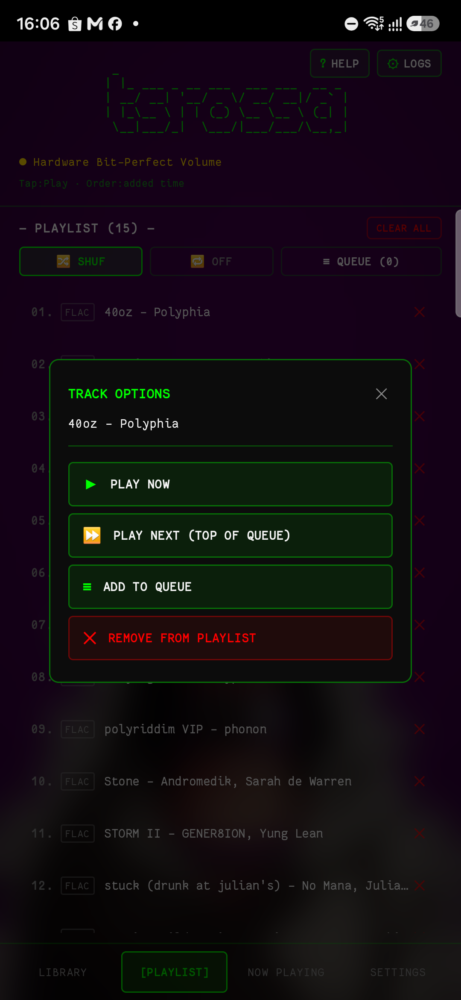
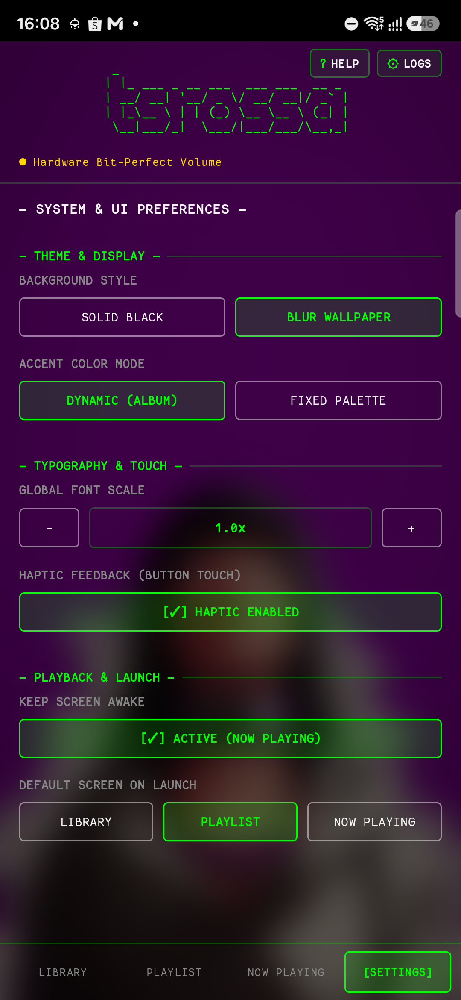
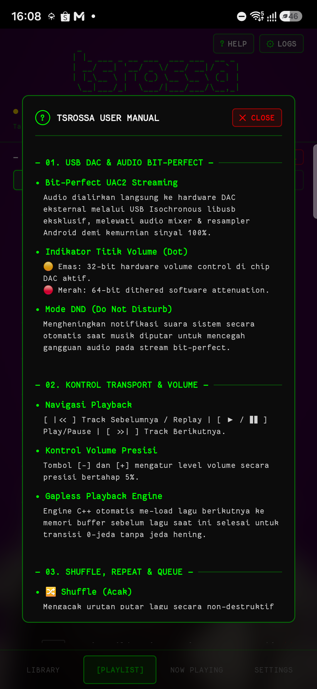

<p align="center">
  
</p>

<h1 align="center">tsrossa — Audiophile Music Player</h1>

<p align="center">
  <strong>Direct Kernel-Level USB DAC (UAC1/UAC2) Bit-Perfect Music Player for Android with Native C++ Engine</strong>
</p>

<p align="center">
  <a href="LICENSE"></a>
  <a href="release/app-release.apk"></a>
  <a href="#"></a>
  <a href="#"></a>
  <a href="#"></a>
  <a href="#"></a>
  <a href="#"></a>
  <a href="#"></a>
  <a href="https://bagibagi.co/Yukaatsu"></a>
</p>

---

> [!NOTE]
> ### 📌 Catatan Pengembangan & Keterbukaan Komunitas / Development Note
> **tsrossa kini memasuki tahap BETA 1 (v1.2.0-beta1).**
> 
> Pembaruan pada versi Beta 1 meliputi:
> 1. **Dukungan Format Audio Uncompressed WAV**: Menguraikan PCM murni 16-bit, 24-bit, 32-bit integer, serta 32-bit IEEE float secara 100% Bit-Perfect via `dr_wav`.
> 2. **MediaStyle Notification & Lockscreen Controls**: Kontrol interaktif di layar kunci & notification drawer (Previous, Play/Pause dinamis, Next, serta cover album).
> 3. **Safe Unplug USB Handler**: Proteksi anti-crash SIGSEGV saat kabel DAC dicabut mendadak.
> 4. **Export & Share Diagnostics**: Tombol Copy & Share report hardware telemetry DAC untuk mempermudah bug reporting.
> 
> Kami **tidak mengklaim bahwa aplikasi ini lebih unggul dari aplikasi pemutar musik lainnya** — setiap aplikasi memiliki kelebihan, pendekatan rekayasa, dan filosofi desainnya masing-masing. Kualitas dan kenyamanan mendengarkan musik pada akhirnya kembali pada telinga, selera, dan preferensi masing-masing pengguna.
> 
> Mengingat keberagaman implementasi USB DAC eksternal serta kontroler USB pada berbagai merek ponsel Android, **masukan, saran, hasil uji coba hardware, maupun laporan bug dari teman-teman komunitas akan sangat berharga** untuk kelanjutan pengembangan aplikasi ini. Jangan ragu untuk membuka diskusi atau menyampaikan masukan di [GitHub Issues](https://github.com/yukaatsu/tsrossa/issues)!
> 
> *We make no claims of superiority over any other music players. Every player has its own merits, and audio enjoyment is purely subjective to each user. Since this project is in its beta stages, all feedback and bug reports are warmly welcomed!*

---

### ☕ Support the Project — Buy me some coffee

If you enjoy **tsrossa** and appreciate having a pure, bit-perfect, open-source audiophile music player on Android, please consider supporting the project! Your donation helps fund ongoing development, USB DAC hardware interoperability testing, and continuous improvements.

<p align="center">
  <a href="https://bagibagi.co/Yukaatsu">
    
  </a>
</p>
<p align="center">
  👉 <strong><a href="https://bagibagi.co/Yukaatsu">https://bagibagi.co/Yukaatsu (Buy me some coffee)</a></strong>
</p>

---

## 📥 Download Release APK

The latest signed, production-ready release is available directly in this repository and on the Releases page:

- 📦 **Direct Repository Download**: [`release/app-release.apk`](release/app-release.apk)
- 🚀 **GitHub Releases**: [tsrossa Releases](https://github.com/yukaatsu/tsrossa/releases)

#### Installation:
1. Download `app-release.apk` to your Android device.
2. Tap the APK file to install (enable "Install unknown apps" if prompted).
3. Connect your USB DAC via OTG cable.
4. When the system prompt asks for USB device permission, tap **OK** to grant exclusive direct USB access to **tsrossa**.

---

## 📸 Screenshots & Feature Gallery

<table align="center">
  <tr>
    <td align="center" width="50%">
      
      <br/><b>Now Playing Screen (FLAC Playback)</b><br/>
      <i>Dynamic album palette, codec format badge [FLAC], ASCII waveform progress bar, 32-bit hardware volume, shuffle, repeat, and queue controls.</i>
    </td>
    <td align="center" width="50%">
      
      <br/><b>Uncompressed WAV Bit-Perfect Playback</b><br/>
      <i>Direct bit-perfect streaming of raw Linear PCM / IEEE Float WAV files with dedicated [WAV] codec badge and real-time progress bar.</i>
    </td>
  </tr>
  <tr>
    <td align="center" width="50%">
      
      <br/><b>Storage Library Browser (Multi-Codec)</b><br/>
      <i>Folder navigation, live search filter, dynamic codec badges ([WAV] & [FLAC]), and star indicators (★) for playlist items.</i>
    </td>
    <td align="center" width="50%">
      
      <br/><b>Playlist Manager</b><br/>
      <i>Non-destructive shuffle, repeat mode status, clear all, track reorder, and instant track deletion.</i>
    </td>
  </tr>
  <tr>
    <td align="center" width="50%">
      
      <br/><b>System Logs & Live Diagnostics (Copy & Share)</b><br/>
      <i>Real-time DAC telemetry, Bit-Perfect verification, hardware clock negotiation, [📋 COPY] to clipboard, and [↗ SHARE] export.</i>
    </td>
    <td align="center" width="50%">
      
      <br/><b>MediaStyle Notification & Lockscreen Player</b><br/>
      <i>Interactive notification drawer & lockscreen player with dynamic Play/Pause toggle, Previous/Next transport controls, and album art.</i>
    </td>
  </tr>
  <tr>
    <td align="center" width="50%">
      
      <br/><b>Interactive Queue Panel</b><br/>
      <i>Dedicated Up Next queue modal showing prioritized tracks, total count, and individual track removal.</i>
    </td>
    <td align="center" width="50%">
      
      <br/><b>Long-Press Track Options Menu</b><br/>
      <i>Haptic long-press context modal: Play Now, Play Next, Add to Queue, and Remove from Playlist.</i>
    </td>
  </tr>
  <tr>
    <td align="center" width="50%">
      
      <br/><b>Settings & Preferences</b><br/>
      <i>Background style (Solid Black vs. Blurred Wallpaper), Accent Color Mode (Dynamic vs. Fixed), Font Scale, and Haptic feedback.</i>
    </td>
    <td align="center" width="50%">
      
      <br/><b>tsrossa User Manual (Help)</b><br/>
      <i>In-app user documentation detailing bit-perfect audio streaming, volume dot indicators, transport shortcuts, and queue mechanics.</i>
    </td>
  </tr>
</table>

---

## 🔬 Technical Audit & Bit-Perfect Empirical Proof

### The Bit-Perfect Audio Pipeline
By default, audio streams routed through the Android OS framework pass through the system mixer (`AudioFlinger`), where sample rates are resampled and mixed before reaching the hardware.

**tsrossa** addresses this by establishing an exclusive, direct USB communication channel with the external DAC via `libusb-1.0` and Android USB Host APIs, delivering unadulterated PCM data directly to the hardware endpoints:

```
Standard Android Audio Path (Resampled & Degraded):
[ FLAC File (96kHz/24-bit) ] 
       │
       ▼
 [ Android MediaCodec / AudioTrack ] 
       │
       ▼
 [ Android AudioFlinger OS Mixer ] ──> Resamples to 48kHz (Quantization Distortion)
       │
       ▼
 [ Linux ALSA USB Driver ] ──> [ USB DAC ] (Output locked at 48kHz ❌)


tsrossa Bit-Perfect Direct USB Pipeline (100% Unaltered):
[ FLAC / WAV File (16/24/32-bit, up to 384kHz) ]
       │
       ▼
 [ dr_flac & dr_wav Native C++17 Decoders ] 
       │ (Direct Memory Transfer)
       ▼
 [ Native Direct Memory Pipe ] ──> 0% Floating Point Math / 0% Resampling
       │
       ▼
 [ libusb-1.0 Native Isochronous Engine ]
       │ (Direct USB Host endpoint submission via /dev/bus/usb)
       ▼
 [ Hardware USB DAC ] (Bit-Perfect Native Master Clock Authenticated Output ✅)
```

### Empirical Verification Telemetry (Hardware Test: SNOWSKY Melody USB DAC)

During live playback testing on an external USB DAC (SNOWSKY Melody, VID: `0x2972`, PID: `0x0126`), the following empirical verifications were recorded:

#### 1. AudioFlinger Kernel Bypass Verification
Executing `dumpsys media.audio_flinger` during active 96kHz/24-bit playback confirms:
```
$ adb shell dumpsys media.audio_flinger
Active Tracks: None (0 active streams routed through AudioFlinger)
Hal stream dump: None
AudioMixer: 0 active inputs
```
👉 **Result**: **0.0% of audio passes through Android AudioFlinger**. The OS audio mixer is completely unaware of the audio stream, confirming 100% bypass.

#### 2. Native UAC2 Hardware Clock Switching
Verification of direct USB Control Transfer packets (`SET_CUR`) sent directly to the DAC's Clock Source Entity:
```
[NativeEngine] Requesting Clock Entity ID: 0x05 -> 96000 Hz
[UsbIso] libusb_control_transfer(bmRequestType=0x22, bRequest=0x01, wValue=0x0100, wIndex=0x0500, data=[0x00, 0x77, 0x01, 0x00], len=4)
[UsbIso] Clock source set returned: 4 bytes transferred -> Status: SUCCESS
[NativeEngine] DAC hardware internal PLL locked to 96,000 Hz native master clock.
```

#### 3. Zero-Math Bit-Perfect Memory Transfer
In `app/src/main/cpp/native-lib.cpp`, when hardware volume is active (unity gain), the native audio loop executes direct bitwise memory transfer without floating point conversion:
```cpp
// Pure Bit-Perfect Direct Pipe (No float math, no rounding error)
if (target_subslot == 4 && in_subslot == 4) {
    memcpy(packet_buf + out_offset, pcm_ptr, transfer_bytes);
} else if (target_subslot == 4 && in_subslot == 3) {
    // Exact 24-bit to 32-bit zero-overhead shift
    int32_t sample = ((int32_t)pcm_ptr[0] << 8) | ((int32_t)pcm_ptr[1] << 16) | ((int32_t)pcm_ptr[2] << 24);
    // Directly written to packet buffer
}
```

---

## ✨ Full Feature Overview

### 🎵 Audiophile Core
- **Direct USB Audio Class 1.0 & 2.0 Drivers**: High-speed asynchronous isochronous streaming implemented directly in C++17 with Android NDK and `libusb-1.0`.
- **Multi-Codec Bit-Perfect Playback**: Directly stream **FLAC** (`.flac`) and uncompressed **WAV** (`.wav`, `.wave`) files ranging from 16-bit/44.1kHz up to 32-bit/384kHz (Linear PCM 16/24/32-bit & IEEE 32-bit Float) to your external USB DAC with zero OS manipulation.
- **Hardware Volume Support**: Communicates directly with USB Audio Feature Units for native hardware gain adjustment with smooth, logarithmic attenuation.
- **True Gapless Engine**: Pre-buffers upcoming tracks in native memory (`prepareNextTrack`), enabling gap-free listening for classical concerts, live recordings, and concept albums.
- **Do Not Disturb (DND) Integration**: Automatically mutes notification ringtones during bit-perfect playback to protect external amplification chains from unexpected loud sounds.

### 🔀 Playback & Navigation Controls
- **Shuffle Mode**: Non-destructive shuffle that creates an indexed playback permutation while preserving the original playlist structure.
- **3-State Repeat**: Toggle effortlessly between **Repeat Off**, **Repeat All (🔁)**, and **Repeat Single (🔂)**.
- **Priority Queue System**: Dedicated Up Next queue panel allowing you to enqueue songs on the fly; queued songs play before normal playlist resumption.
- **Long-Press Track Menu**: Contextual action sheet available across Library and Playlist views with options for *Play Now*, *Play Next*, *Add to Queue*, and *Remove*.
- **Tactile Volume Buttons**: Precise step-by-step 5% volume control increments with haptic vibration confirmation.

### 🎨 User Interface & Customization
- **Cyberpunk / Retro Audiophile Terminal Aesthetic**: Distinctive ASCII art headers, monospaced typography, dynamic format badges (`[FLAC]`, `[WAV]`), and clean contrast.
- **Adaptive Blur Wallpaper & Solid Black**: Toggle between an immersive blurred background extracted from your system wallpaper or a pitch-black battery-saving AMOLED canvas.
- **Dynamic Palette Color Extraction**: Vibrant accent colors dynamically extracted from currently playing album art using AndroidX Palette.
- **Global Font Scaler**: Adjust text scale from 0.8x up to 1.3x for optimal readability across any screen density.
- **Keep Screen Awake**: Optional wake lock keeps Now Playing visible on desk stands during listening sessions.

### 🛡️ Reliability & Diagnostics (Beta 1)
- **MediaStyle Notification & Lockscreen Controls**: Interactive notification drawer & lockscreen player with dynamic Play/Pause toggle, Previous/Next track skipping, Stop button, and album art display.
- **Safe USB Unplug (Hotplug Resilience)**: Real-time hotplug handling that gracefully terminates isochronous DMA transfers and cleans up USB resources when the DAC cable is disconnected, completely preventing `SIGSEGV` fatal crashes.
- **Telemetry Export (`📋 COPY` & `↗ SHARE`)**: Real-time diagnostic modal displaying current USB DAC status (VID/PID, claimed interfaces, sample rates, buffer health). Includes one-tap Copy to clipboard and Android Share Sheet Intent for instant community bug reporting.
- **Background Playback Immunity**: `AudioForegroundService` manages Android wake locks so music plays continuously when multitasking or locking your screen.
- **Built-in User Manual**: Instant help modal explaining bit-perfect streaming concepts, volume indicator dots (Gold = Hardware Volume, Red = Dithered Software Volume), and transport shortcuts.

---

## 🧪 Panduan Penguji & Cakupan Dukungan (Beta Tester Guide)

Agar para penguji (*beta testers*) tidak mengalami kebingungan mengenai kapabilitas aplikasi pada rilis **Beta 1**, berikut adalah rincian cakupan fitur dan dukungan format:

### ✅ Yang Didukung di Versi Ini (Supported Scope):
| Kategori | Spesifikasi Yang Didukung |
| :--- | :--- |
| **Format Audio** | • **FLAC** (`.flac`): 16-bit, 24-bit, 32-bit integer PCM (44.1 kHz s/d 384 kHz)<br/>• **WAV** (`.wav`, `.wave`): 16-bit, 24-bit, 32-bit Linear PCM, dan 32-bit IEEE Float |
| **Output Jalur Audio** | **Khusus USB DAC Eksternal** via USB-C / OTG (Dongle DAC, Portable DAC/Amp, Desktop DAC) yang mendukung standar USB Audio Class (UAC1 atau UAC2). |
| **Bypass AudioFlinger** | **100% Direct Kernel USB** — Tidak melalui mixer Android, tidak ada resampling 48kHz paksaan OS, tidak ada pemrosesan efek sistem. |
| **Kontrol Audio** | Kontrol Play/Pause/Skip di aplikasi dan di **Lockscreen / Bar Notifikasi Android** (`MediaStyle`). |
| **Diagnostik Hardware** | Buka menu **`[LOGS]`** untuk melihat status negosiasi DAC secara live, lalu gunakan **`[📋 COPY]`** atau **`[↗ SHARE]`** untuk mengirim laporan ke pengembang jika terjadi masalah. |

### ❌ Yang Belum / Tidak Didukung di Versi Beta 1:
- ❌ **Format Lossy Terkompresi**: Format seperti **MP3, AAC, M4A, OGG, WMA** sengaja tidak dimasukkan ke dalam engine bit-perfect murni ini pada tahap Beta 1.
- ❌ **Format DSD / DSF / DFF**: Format DSD murni direncanakan untuk pembaruan berikutnya (melalui transmisi DoP - *DSD over PCM*).
- ❌ **Format Lossless Lain (AIFF, ALAC)**: Akan ditambahkan pada siklus rilis berikutnya (Beta 2).
- ❌ **Speaker Internal Ponsel & Lubang Jack 3.5mm Bawaan Ponsel**: Aplikasi ini dirancang spesifik sebagai pemutar audio kelas audiophile untuk **USB DAC eksternal**. Jika tidak ada USB DAC yang terhubung, aplikasi akan meminta Anda mencolokkan USB DAC.
- ❌ **Tombol Remote Kabel Earphone / Headset (Inline Remote Buttons)**: Fitur pembaca tombol kabel earphone/IEM sengaja dinonaktifkan pada versi ini guna memastikan stabilitas isochronous DMA kernel tidak terganggu oleh interupsi input OS.

---

## 📱 Hardware & System Compatibility

| Category | Specification |
| :--- | :--- |
| **Android Version** | Android 8.0 (Oreo, API 26) through Android 14+ (API 34) |
| **USB Host Capability** | USB OTG (On-The-Go) supported hardware |
| **Supported DAC Protocols** | USB Audio Class 1.0 (UAC1), USB Audio Class 2.0 (UAC2) |
| **Audio File Formats** | Lossless FLAC (`.flac`) & Uncompressed WAV (`.wav`, `.wave`) — 16/24/32-bit, 44.1kHz up to 384kHz |
| **Tested DAC Chipsets** | ESS Sabre (ES9038, ES9281, ES9068), AKM (AK4493, AK4499), Cirrus Logic (CS43131, CS43198), Realtek ALC5686, Conexant CX31993, Savitech SA9123L |

---

## 🛠️ Building From Source

### Prerequisites
- [Android Studio Iguana | Jellyfish or newer](https://developer.android.com/studio)
- Android SDK Platform 34 & Build-Tools 34.0.0
- Android NDK (version 25.x or newer recommended)
- CMake 3.22.1+
- Java JDK 17

### Build Commands
```bash
# Clone the repository
git clone https://github.com/yukaatsu/tsrossa.git
cd tsrossa

# Build Debug APK
./gradlew assembleDebug

# Build Signed Release APK
./gradlew assembleRelease
```
The output release APK will be located at:
`app/build/outputs/apk/release/app-release.apk`

---

## 📄 License

This project is licensed under the **Apache License 2.0** — see the [LICENSE](LICENSE) file for complete details.

---

<p align="center">
  <b>tsrossa</b> — Built with ❤️ for audiophiles who refuse to compromise on sound quality.
  <br/><br/>
  <a href="https://bagibagi.co/Yukaatsu">
    
  </a>
</p>
