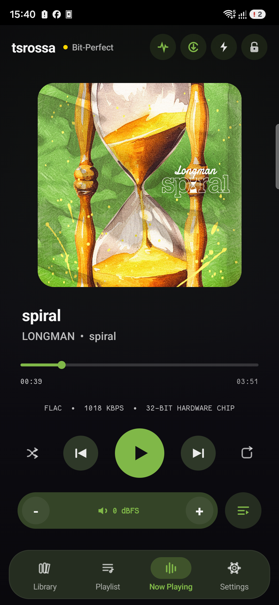
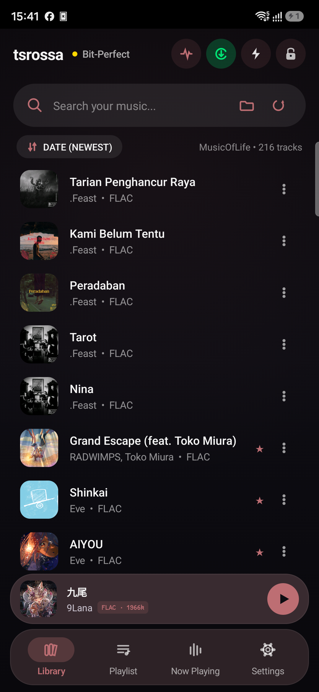
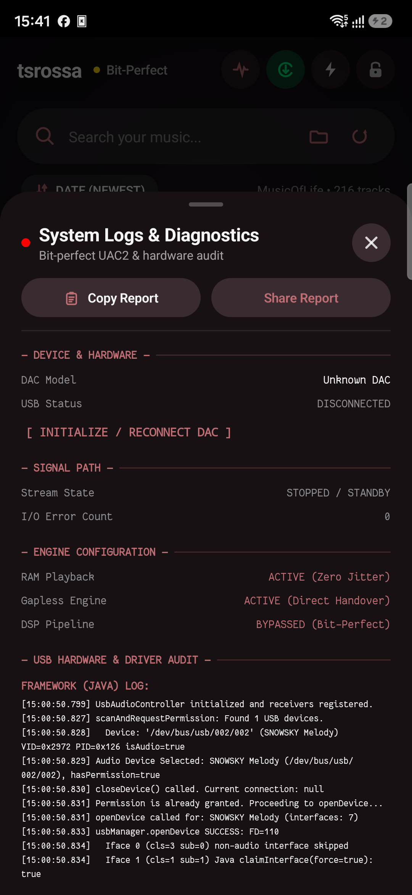

<p align="center">
  
</p>

<h1 align="center">tsrossa</h1>

<p align="center">
  <strong>Direct-to-DAC, Bit-Perfect USB Music Player for Android</strong><br/>
  Bypasses Android's audio framework to stream bit-perfect PCM straight to external USB DACs.
</p>

<p align="center">
  <a href="https://github.com/yukaatsu/tsrossa/releases"></a>
  <a href="#"></a>
  <a href="#"></a>
  <a href="#"></a>
  <a href="LICENSE"></a>
  <a href="https://bagibagi.co/Yukaatsu"></a>
</p>

> 💡 **Looking for the macOS desktop version?**  
> We keep each platform in its own dedicated branch. Switch to the [`macos` branch](https://github.com/yukaatsu/tsrossa/tree/macos) or run:  
> `git clone -b macos --single-branch https://github.com/yukaatsu/tsrossa.git tsrossa-mac`

---

## Why tsrossa?

If you plug a USB DAC or dongle into Android, the operating system routes all audio through `AudioTrack` and `AudioFlinger`. Even if your file is 44.1 kHz, 96 kHz, or 192 kHz, Android forces it through a software resampler (SRC) to a fixed 48 kHz, runs it through internal digital volume attenuation, and adds latency.

**tsrossa bypasses the Android audio stack entirely.**

It asks Android only for the raw USB permission (`usbfs` file descriptor). From that moment on, a native C++17 engine talks directly to your DAC via `libusb`, tells the physical DAC clock which crystal oscillator frequency to switch to, pre-loads the audio into RAM with POSIX `mlock()`, and sends the raw PCM stream over USB Isochronous endpoints. 

What's in your file is bit-for-bit what reaches your DAC's converter chip. No resampling, no mixer, no OS interference.

---

## Screenshots

<table align="center">
  <tr>
    <td align="center" width="33%">
      
      <br/><b>Now Playing</b><br/>
      <sub>Adaptive album art theme, smooth scrubber, tactile header controls, and synchronized lyrics</sub>
    </td>
    <td align="center" width="33%">
      
      <br/><b>Library Browser</b><br/>
      <sub>Fast cached browser with live search, folder picking, intelligent filename parsing, and 11 sort modes</sub>
    </td>
    <td align="center" width="33%">
      
      <br/><b>Hardware Telemetry</b><br/>
      <sub>Live UAC endpoint audit, clock verification, RAM buffer stats, and 1-tap diagnostic report export</sub>
    </td>
  </tr>
</table>

---

## Highlights

- **Direct Kernel-Level USB Audio (`usbfs` + `libusb-1.0`)**  
  Zero `AudioTrack`, zero `AudioFlinger`. The C++17 engine manages asynchronous USB Isochronous transfers directly.
- **Physical Clock Switching (UAC1 & UAC2)**  
  Reads your DAC's USB descriptors to configure the hardware oscillator via `CS_SAMPLING_FREQ_CONTROL`. A 44.1 kHz track plays at 44.1 kHz; a 192 kHz track plays at 192 kHz.
- **RAM Pre-Caching with Memory Pinning (`mlock`)**  
  Decodes audio files into a linear PCM buffer in RAM and locks the pages so the Linux kernel never swaps them to flash storage, eliminating micro-stutters.
- **Dual Volume Architecture**  
  - **Hardware UAC Mode:** Controls the DAC's internal volume registers via `FU_VOLUME_CONTROL`. At 100%, it engages bit-perfect True Unity Gain (0.0 dBFS).
  - **64-bit Studio-Taper DSP:** Calibrated logarithmic curve with decorrelated SplitMix64 TPDF dither and mid-tread quantization (`std::llrint`) for DACs without hardware mixers.
- **Gapless Playback**  
  Background worker decodes the upcoming track into a secondary RAM buffer and seamlessly hands over USB packets across track boundaries without pops or gaps.
- **Modern Material 3 Interface**  
  Built with Jetpack Compose. Dynamic color palettes extracted from album artwork, clean typography, synchronized `.lrc` lyrics, fast alphabet scroller, and a dedicated DAP (Screen Pinning) mode to turn older phones into dedicated audio transports.

---

## Format & Hardware Support

| Category | Details |
| :--- | :--- |
| **Supported Formats** | • **FLAC** (`.flac`): 16-bit, 24-bit, 32-bit PCM (44.1 kHz up to 384 kHz)<br/>• **WAV** (`.wav`, `.wave`): 16-bit, 24-bit, 32-bit Linear PCM, and 32-bit IEEE Float |
| **Target Hardware** | Any USB DAC connected via USB-C OTG (Dongle DACs, portable DAC/amps, desktop DACs) |
| **USB Class** | USB Audio Class 1.0 (UAC1) & USB Audio Class 2.0 (UAC2) |
| **Transfer Type** | Asynchronous and Adaptive Isochronous USB endpoints |
| **Android Version** | Android 8.0 (Oreo / API 26) through Android 15+ (API 35+) |

> **Note on Scope**: tsrossa is intentionally focused on bit-perfect offline playback for external USB DACs. Lossy formats (MP3, AAC) and internal phone speakers / Bluetooth are bypassed to keep the native audio pipeline clean and jitter-free.

---

## Quick Start

### 1. Download & Install
Grab the latest release `.apk` from the [Releases page](https://github.com/yukaatsu/tsrossa/releases) and install it on your Android device.

### 2. Connect Your DAC
1. Plug your USB DAC into your phone using an OTG cable or USB-C interconnect.
2. When Android shows the **"Allow tsrossa to access [Your DAC]?"** prompt, check *Always allow* and tap **OK**.
3. Pick a track from your library and enjoy bit-perfect playback.

### 3. Hardware Diagnostics & Telemetry
Tap the **`[LOGS]`** button in the top header to inspect:
- Real-time negotiated sample rate & bit depth
- Active USB endpoint addresses and buffer latency
- Bit-perfect transmission verification
- One-tap button to copy or share the diagnostic log for troubleshooting

---

## Building from Source

If you prefer building tsrossa yourself:

### Prerequisites
- JDK 17 (e.g. OpenJDK 17)
- Android SDK (`compileSdk = 34`, `minSdk = 26`)
- Android NDK (r25+ / `25.1.8937393` or newer)
- CMake 3.22.1+

Make sure your `local.properties` points to your Android SDK:
```properties
sdk.dir=/path/to/your/Android/sdk
```

### Build Commands
```bash
# Clean build
./gradlew clean

# Build debug APK
./gradlew assembleDebug

# Build release APK
./gradlew assembleRelease
# Output: app/build/outputs/apk/release/app-release.apk

# Run unit tests
./gradlew test
```

---

## Community & Support

tsrossa is an independent open-source project. If it brings your music to life or gives your portable setup new clarity, support is warmly appreciated:

[](https://bagibagi.co/Yukaatsu)

Found a bug or have DAC compatibility data? Feel free to open an issue on [GitHub Issues](https://github.com/yukaatsu/tsrossa/issues) with your hardware log report attached!

---

## License

tsrossa is licensed under the [Apache License 2.0](LICENSE).
